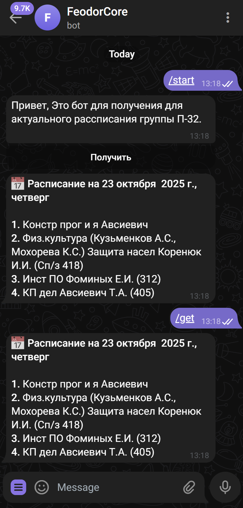
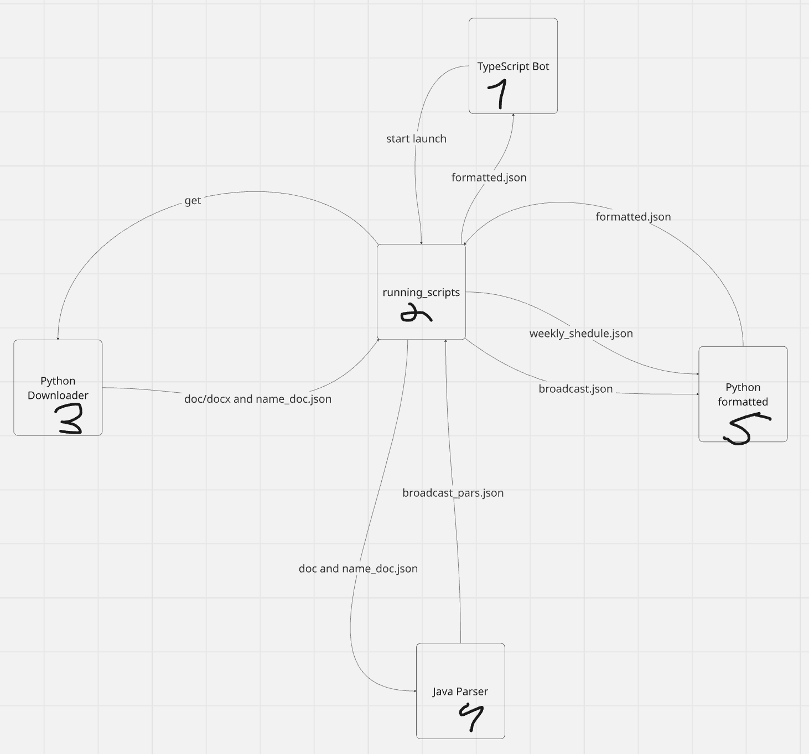

# ⚙️ BOT-PARS-FILE

Проект представляет собой телеграм‑бота на TypeScript, интегрирующего Python‑скрипты для получения и формирования актуального расписания с сайта колледжа, а также Java‑модуль для дальнейшего парсинга данных.
Архитектура решения построена на разделении ответственности:
- TypeScript — логика бота и взаимодействие с пользователем - отправка готового рассписания.
- Python — загрузка и подготовка файлов с сайта, конечное структурирование данных, которые спасены Java скриптом.
- Java — парсинг файлов Doc/Docx

## 💡 Установка и запуск

1. Клонируйте репозиторий:
```
git clone https://github.com/FeodorCore/Bot-pars-file
```

2. Установите Python-зависимости:
```
pip install -r requirements.txt
```

3. Скомпилируйте Java-парсер (Maven автоматически подтянет все зависимости):
```
mvn clean package
```
3. Установите Node.js-зависимости:
```
npm install
```
4. Скомпилируйте TypeScript в JavaScript:
```
npm run build 
```
5. В файл .env добавьте сгенерированный токен из BotFather:
```
BOT_TOKEN=ЗДЕСЬ ВСТАВЬТЕ ТОКЕН
```
6. Запустите бота:
```
node dist/bot.js
```

## 🎮 Команды

- `/start`: Запуск бота.
- `/get`: Получить рассписание.

## 📲 Диалог с ботом


## 🔄 Принцип работы


## 📁 Структура проекта
```
|    |—— Bot-pars-file.iml
|—— requirements.txt
|—— running_scripts.py
|—— Scripts
|    |—— Input-Output
|        |—— Download-doc
|            |—— info_20251002_095642_b2a67b3a.doc
|            |—— info_20251007_161311_99a08e9b.doc
|            |—— info_20251017_152704_eb4cf49c.doc
|            |—— info_20251021_152531_64c1f1a4.doc
|            |—— info_20251022_165226_a6e33d6e.doc
|            |—— download_file3.docx
|            |—— download_file2.doc
|            |—— download_file1.docx
|        |—— json-file
|            |—— broadcast_pars.json
|            |—— formatted.json
|            |—— name_doc.json
|            |—— weekly_schedule.json
|        |—— yaml-file
|            |—— history.yaml
|    |—— Java-parser
|        |—— .gitignore
|        |—— dependency-reduced-pom.xml
|        |—— pom.xml
|        |—— src
|            |—— main
|                |—— java
|                    |—— org
|                        |—— example
|                            |—— common
|                                |—— DataWriter.java
|                                |—— DocumentContent.java
|                                |—— DocumentParseException.java
|                                |—— DocumentProcessor.java
|                                |—— FileManager.java
|                                |—— FileNameReader.java
|                                |—— JsonManager.java
|                                |—— LessonData.java
|                                |—— Parser.java
|                                |—— ScheduleLineProcessor.java
|                                |—— TextProcessor.java
|                                |—— YamlManager.java
|                            |—— Doc
|                                |—— DocumentParser.java
|                            |—— Docx
|                                |—— DocxDocumentParser.java
|                            |—— Main.java
|        |—— target
|            |—— classes
|                |—— org
|                    |—— example
|                        |—— common
|                            |—— DataWriter.class
|                            |—— DocumentContent.class
|                            |—— DocumentParseException.class
|                            |—— DocumentProcessor.class
|                            |—— FileManager.class
|                            |—— FileNameReader.class
|                            |—— JsonManager.class
|                            |—— LessonData.class
|                            |—— Parser.class
|                            |—— ScheduleLineProcessor.class
|                            |—— TextProcessor.class
|                            |—— YamlManager.class
|                        |—— Doc
|                            |—— DocumentParser.class
|                        |—— Docx
|                            |—— DocxDocumentParser.class
|                        |—— Main.class
|    |—— Python-downloader
|        |—— main.py
|    |—— Python-formatted
|        |—— main.py
|    |—— TypeScript-tgBot
|        |—— src
|            |—— bot.ts
|            |—— commands.ts
|            |—— handlers
|                |—— index.ts
|                |—— schedule.ts
|                |—— start.ts
|            |—— keyboard.ts
|            |—— services
|                |—— pythonRunner.ts
|            |—— utils
|                |—— helpers.ts
|        |—— tsconfig.json
```
